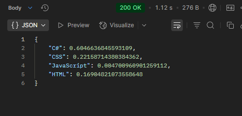

# Interactive API with github made for extra datas and simplificate functions.

### What can I do?

 

- Get repos
- Get languages of repos
- Get totalBytes of repos
- Get percentage of languages on a repo

### How to use?

The base url is 'http://localhost:XXXX/api'

OBS: You have to run it on your own machine

### Get Started

## Now we have the base url, know that every endpoint I show you is going to start with the base
## So if I say the endpoint is "/yxz" the entire url is gonna be "http://localhost:XXXX/api/xyz"

### RETURN / DATA

### Every endpoint return has the same data format, a json with the content.
### Just like:

 

## Endpoints

| Endpoint                     | Params             | Result                                                 |
|------------------------------|--------------------|--------------------------------------------------------|
| /user                        | username           | all userinfo                                           |
| /user/repos                  | username, reponame | simplificated info about all repos                     |
| /user/languages              | username, reponame | get language info about some repo                      |
| /user/languages/totalbytes   | username, reponame | get the totalbytes used by all languages on a repo     |
| /user/languages/bytesperlang | username, reponame | get a double number that multiplied by 100 represent % |

## How to use the params

#### Having a endpoint, you can follow this steps

- ENDPOINT: I'm taking the '/user/languages/bytesperlang' for example

## So, we're passing the params in this logic:
 

## <b>"URL" + "?" + (PARAMS)<b/>

 

### In (PARAMS) you can pass one by one by:
### param1=param1&param2=param2&...

### Then, in a situation I can acess infos about "Restaurant" repo I will put:
#### http://localhost:XXXX/api/user/languages/bytesperlang<i>?<i/><b>reponame=Restaurant&username=JoaoPauloQC<b/>